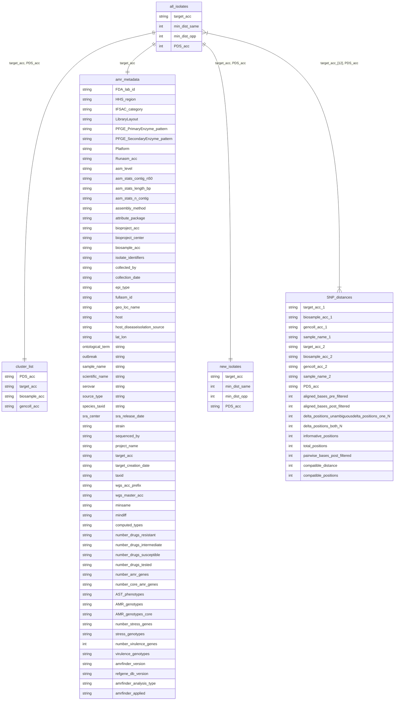

# Pathogen Detection toolkit
A way to interact with the data from the NCBI Pathogen Detection Portal.
This specific repo was not developed by anyone at NCBI however.

For more information: https://www.ncbi.nlm.nih.gov/pathogens

# Usage

```text
pdtk.pl: interacts with the NCBI Pathogens Portal
  Usage: pdtk.pl [options]
  SUBCOMMANDS
  --list             List which taxa are available
  --download         Download data to ~/.pdtk
  --query            Query from S1
  --clean            (TODO) clean up ~/.pdtk
  --find-target S1   Find rows matching an accession.
                     Useful for finding PDT accessions.
                     Searches fields: sample_name, biosample_acc, target_acc, gencoll_acc, PDS_acc
                     Use SQLite syntax for wildcards, e.g., %
  --help             This useful help menu

  OPTIONS
  --taxon    TAXON   Limit the query to this taxon
  --sample1  S1      PDT accession to query from
  --within   X       Number of SNPs to query away from S1
  --sample2  S2      PDT accession to query from S1
```

# Installation

Simply run the script directly or bring it into your path.

```bash
cd ~/bin
git clone git@github.com:lskatz/pdtk.git
export PATH=$HOME/bin/pdtk/scripts:$PATH
```

## Requirements

* Perl
* SQLite3

# Examples

## List of all possible datasets to interact with

```bash
perl scripts/pdtk.pl --list | shuf | head -n 5 | sort
Enterobacter_kobei
Kosakonia_oryzendophytica
Pluralibacter_gergoviae
Staphylococcus_aureus
Yersinia_ruckeri
```

## Download the data

To run the rest of this toolkit, you will need the data locally.
This subcommand downloads from the FTP site, then indexes with SQLite.

```bash
perl pdtk.pl --download
```

## Query

The toolkit is very limited at this time to simple querying.
To request anything, please make an issues ticket on github and be specific.

Querying is done using PDT accessions.

### Find close neighbors

Distance is measured in `compatible_distance` which is derived from SNP distances.
Output columns match what is found in the NCBI files but the order of those columns is not stable.

In this example, we are looking for anything within 1 SNP of our accession.

```bash
pdtk.pl --query --sample1 PDT000503455.1 --taxon Listeria --within 1 | column -t

compatible_distance  target_acc_2    aligned_bases_pre_filtered  sample_name_2  biosample_acc_1  informative_positions  sample_name_1  total_positions  delta_positions_both_N  delta_positions_one_N  delta_positions_unambiguous  pairwise_bases_post_filtered  target_acc_1    PDS_acc         compatible_positions  gencoll_acc_1    aligned_bases_post_filtered  gencoll_acc_2    biosample_acc_2
1                    PDT000503469.1  2855359                     NULL           SAMN11784268     2                      NULL           2                0                       0                      1                            NULL                          PDT000503455.1  PDS000045942.1  2                     GCA_005875935.1  2855359                      GCA_005875995.1  SAMN11784285
1                    PDT000503497.1  2846243                     NULL           SAMN11784268     2                      NULL           2                0                       0                      1                            NULL                          PDT000503455.1  PDS000045942.1  2                     GCA_005875935.1  2846243                      GCA_005876095.1  SAMN11784330
```

In this example, we are looking for a specific distance between two accessions

```bash
perl pdtk.pl --query --sample1 PDT000503455.1 --taxon Listeria --sample2 PDT000503497.1 | column -t
delta_positions_unambiguous  biosample_acc_1  target_acc_2    delta_positions_both_N  sample_name_1  pairwise_bases_post_filtered  target_acc_1    compatible_positions  compatible_distance  sample_name_2  total_positions  informative_positions  aligned_bases_post_filtered  delta_positions_one_N  biosample_acc_2  gencoll_acc_1    aligned_bases_pre_filtered  gencoll_acc_2    PDS_acc
1                            SAMN11784268     PDT000503497.1  0                       NULL           NULL                          PDT000503455.1  2                     1                    NULL           2                2                      2846243                      0                      SAMN11784330     GCA_005875935.1  2846243                     GCA_005876095.1  PDS000045942.1
```

### Find targets

If you sort of know what you want to query with but don't quite know what the exact target names are,
you can search on these fields: `sample_name`, `biosample_acc`, `target_acc`, `gencoll_acc`, `PDS_acc`.

```bash
perl pdtk.pl --taxon Listeria --find-target PDT000503497% | column -t
target_acc_1    biosample_acc_1  gencoll_acc_1    sample_name_1  target_acc_2    biosample_acc_2  gencoll_acc_2    sample_name_2  PDS_acc         aligned_bases_pre_filtered  aligned_bases_post_filtered  delta_positions_unambiguous  delta_positions_one_N  delta_positions_both_N  informative_positions  total_positions  pairwise_bases_post_filtered  compatible_distance  compatible_positions
PDT000503469.1  SAMN11784285     GCA_005875995.1  NULL           PDT000503497.1  SAMN11784330     GCA_005876095.1  NULL           PDS000045942.1  2848432                     2848432                      0                            0                      0                       2                      2                NULL                          0                    2
PDT000503455.1  SAMN11784268     GCA_005875935.1  NULL           PDT000503497.1  SAMN11784330     GCA_005876095.1  NULL           PDS000045942.1  2846243                     2846243                      1                            0                      0                       2                      2                NULL                          1                    2
PDT000503463.1  SAMN11784293     GCA_005875955.1  NULL           PDT000503497.1  SAMN11784330     GCA_005876095.1  NULL           PDS000045942.1  2844832                     2844766                      1                            0                      0                       2                      2                NULL                          1                    2
```

Aha the full name is `PDT000503497.1` from the results!

Or, a question like which samples are in this particular SNP tree?

```bash
perl pdtk.pl --taxon Listeria --find-target PDS000045942%
target_acc_1    biosample_acc_1 gencoll_acc_1   sample_name_1   target_acc_2    biosample_acc_2 gencoll_acc_2   sample_name_2     PDS_acc aligned_bases_pre_filtered      aligned_bases_post_filtered     delta_positions_unambiguous       delta_positions_one_N   delta_positions_both_N  informative_positions   total_positions pairwise_bases_post_filtered      compatible_distance     compatible_positions
PDT000503455.1  SAMN11784268    GCA_005875935.1 NULL    PDT000503469.1  SAMN11784285    GCA_005875995.1 NULL    PDS000045942.1    2855359 2855359 1       0       0       2       2       NULL    1       2
PDT000503463.1  SAMN11784293    GCA_005875955.1 NULL    PDT000503469.1  SAMN11784285    GCA_005875995.1 NULL    PDS000045942.1    2852801 2852710 1       0       0       2       2       NULL    1       2
PDT000503469.1  SAMN11784285    GCA_005875995.1 NULL    PDT000503497.1  SAMN11784330    GCA_005876095.1 NULL    PDS000045942.1    2848432 2848432 0       0       0       2       2       NULL    0       2
PDT000503455.1  SAMN11784268    GCA_005875935.1 NULL    PDT000503463.1  SAMN11784293    GCA_005875955.1 NULL    PDS000045942.1    2850363 2850272 2       0       0       2       2       NULL    2       2
PDT000503455.1  SAMN11784268    GCA_005875935.1 NULL    PDT000503497.1  SAMN11784330    GCA_005876095.1 NULL    PDS000045942.1    2846243 2846243 1       0       0       2       2       NULL    1       2
PDT000503463.1  SAMN11784293    GCA_005875955.1 NULL    PDT000503497.1  SAMN11784330    GCA_005876095.1 NULL    PDS000045942.1    2844832 2844766 1       0       0       2       2       NULL    1       2
```

# Database

There is an underlying database under ~/.pdtk/pdtk.sqlite3 with this schema



